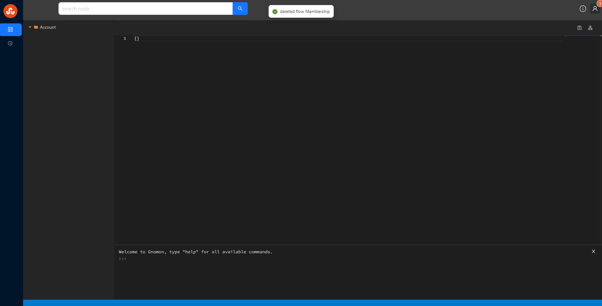

# Flow Builder
a web tool built by React to visualize application data processing. 

# How-to Start 

```bash
git clone https://github.com/Icefoxes/app-flow.git
cd app-flow
docker-compose up
```

# Demo
